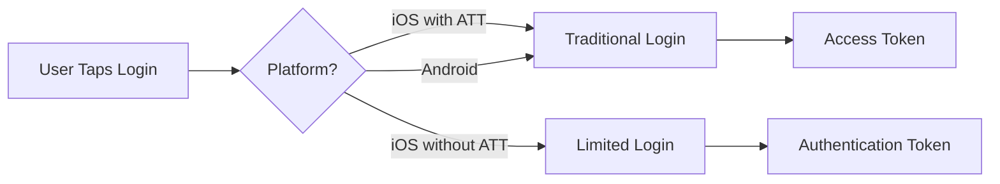

Facebook authentication in React Native FBSDK Next provides secure access to Facebook's services through access tokens and authentication tokens. This page covers the core authentication concepts you need to understand.

## Authentication Flow

When a user logs in with Facebook, the SDK handles the OAuth flow and returns either an **Access Token** (traditional login) or an **Authentication Token** (Limited Login on iOS).



## Access Tokens

An **Access Token** is the primary credential used to access Facebook's Graph API and services. It contains:

- **Token string**: The actual credential used in API calls
- **User ID**: The Facebook user identifier
- **App ID**: Your Facebook application identifier
- **Permissions**: Granted, declined, and expired permissions
- **Expiration times**: Token expiration and data access expiration

### When to Use Access Tokens

- Making Graph API requests
- Accessing user data
- Posting to Facebook
- Traditional Facebook Login flow

### Example: Getting Current Access Token

```javascript
import { AccessToken } from 'react-native-fbsdk-next';

const token = await AccessToken.getCurrentAccessToken();
if (token) {
  console.log('Access Token:', token.accessToken);
  console.log('User ID:', token.userID);
  console.log('Permissions:', token.permissions);
}
```

## Authentication Tokens (iOS Limited Login)

An **Authentication Token** is used in iOS Limited Login, which is required when users opt out of App Tracking Transparency (ATT). It's an OpenID Connect token that provides:

- **Authentication proof**: Verifies the user's identity
- **Nonce**: A unique value for validation
- **Graph domain**: The domain where the user is authenticated

<Warning>
Authentication Tokens **cannot** be used to access the Graph API. They are only for authentication verification.
</Warning>

### When to Use Authentication Tokens

- iOS apps when user denies ATT permission
- Limited Login flow (iOS only)
- Server-side authentication verification
- Privacy-focused implementations

### Example: Getting Authentication Token

```javascript
import { AuthenticationToken } from 'react-native-fbsdk-next';
import { Platform } from 'react-native';

if (Platform.OS === 'ios') {
  const token = await AuthenticationToken.getAuthenticationTokenIOS();
  if (token) {
    console.log('Auth Token:', token.authenticationToken);
    console.log('Nonce:', token.nonce);
    // Send to your server for verification
  }
}
```

## Token Lifecycle

### Token Expiration

Access tokens have multiple expiration times:

- **Token expiration**: When the token becomes invalid
- **Data access expiration**: When permission to access data expires
- **Last refresh**: When the token was last renewed

The SDK automatically attempts to refresh tokens before they expire.

### Token Refresh

You can manually refresh an access token:

```javascript
import { AccessToken } from 'react-native-fbsdk-next';

try {
  const refreshedToken = await AccessToken.refreshCurrentAccessTokenAsync();
  console.log('Token refreshed successfully');
} catch (error) {
  console.error('Failed to refresh token:', error);
}
```

### Listening to Token Changes

Monitor token changes throughout your app:

```javascript
import { AccessToken } from 'react-native-fbsdk-next';

const removeListener = AccessToken.addListener((token) => {
  if (token) {
    console.log('Token updated:', token.accessToken);
  } else {
    console.log('User logged out');
  }
});

// Later, remove the listener
removeListener();
```

## Permissions

Facebook permissions control what data and features your app can access.

### Permission Types

**Read Permissions** (requested during login):
- `public_profile` - Basic profile information
- `email` - User's email address
- `user_friends` - List of friends who use your app
- `user_birthday` - User's birthday

**Write Permissions** (requested separately):
- `publish_actions` - Publish content (deprecated)
- `manage_pages` - Manage Facebook Pages

### Permission States

Permissions can be in three states:

1. **Granted**: User approved the permission
2. **Declined**: User denied the permission
3. **Expired**: Permission was granted but has expired

```javascript
const token = await AccessToken.getCurrentAccessToken();
if (token) {
  console.log('Granted:', token.permissions);
  console.log('Declined:', token.declinedPermissions);
  console.log('Expired:', token.expiredPermissions);
}
```

## Security Best Practices

### Never Store Tokens Client-Side

<Warning>
Never store access tokens in:
- AsyncStorage
- Local files
- Redux state (persisted)

Always retrieve the current token from the SDK when needed.
</Warning>

### Validate Tokens Server-Side

For sensitive operations, validate tokens on your server:

```javascript
// Client side - send token to your server
const token = await AccessToken.getCurrentAccessToken();
await fetch('https://your-api.com/verify', {
  method: 'POST',
  headers: { 'Content-Type': 'application/json' },
  body: JSON.stringify({ accessToken: token.accessToken }),
});
```

```javascript
// Server side - verify with Facebook
const response = await fetch(
  `https://graph.facebook.com/debug_token?input_token=${accessToken}&access_token=${appToken}`
);
const data = await response.json();
if (data.data.is_valid) {
  // Token is valid
}
```

### Use HTTPS Only

Always use HTTPS when transmitting tokens between your app and server.

## Platform Differences

### iOS

- Supports both Access Tokens and Authentication Tokens
- Requires App Tracking Transparency (ATT) for traditional login
- Limited Login available without ATT
- Login behavior is always browser-based

### Android

- Only supports Access Tokens
- No ATT requirement
- Multiple login behaviors available:
  - `native_with_fallback` (default)
  - `native_only`
  - `web_only`

## SDK Initialization

Initialize the SDK before attempting authentication:

```javascript
import { Settings } from 'react-native-fbsdk-next';

// Initialize as early as possible
Settings.initializeSDK();
```

For GDPR compliance, delay initialization until user consent:

```javascript
// Get user consent first
const hasConsent = await getUserConsent();

if (hasConsent) {
  Settings.initializeSDK();
}
```

## See Also

<CardGroup cols={2}>
  <Card title="Login Methods" icon="right-to-bracket" href="/concepts/login-methods">
    Learn about different login methods and when to use them
  </Card>
  
  <Card title="Limited Login" icon="shield" href="/concepts/limited-login">
    Understand iOS Limited Login for privacy-focused apps
  </Card>
  
  <Card title="Access Token API" icon="code" href="/api/access-token">
    Complete API reference for AccessToken
  </Card>
  
  <Card title="Authentication Token API" icon="code" href="/api/authentication-token">
    Complete API reference for AuthenticationToken
  </Card>
</CardGroup>