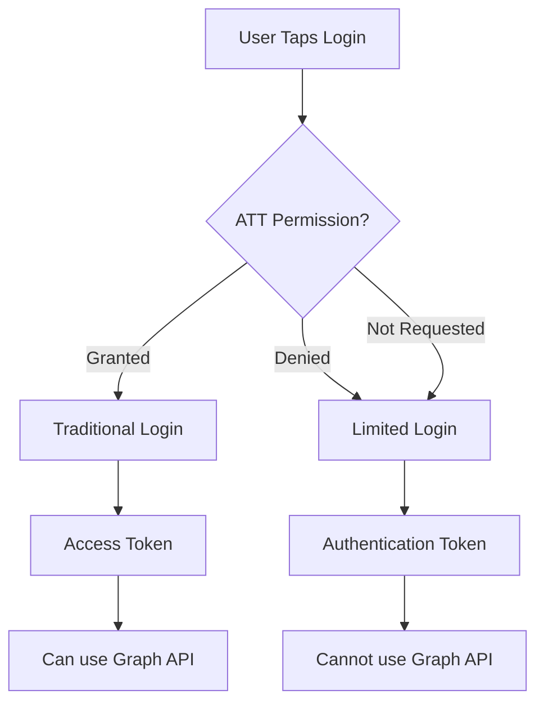

Limited Login is a privacy-focused authentication method introduced by Facebook for iOS apps in response to Apple's App Tracking Transparency (ATT) requirements. It allows users to sign in with Facebook without granting tracking permissions.

## What is Limited Login?

Limited Login provides a way for iOS users who have opted out of App Tracking Transparency to still use Facebook Login. Instead of receiving an Access Token, your app receives an **Authentication Token** (OpenID Connect token) that can verify the user's identity but cannot access the Graph API.

<Note>
  Limited Login is **iOS only** and was introduced in facebook-ios-sdk v17.0.0. React Native FBSDK Next versions 13.0.0 and above require Limited Login support.
</Note>

## When Limited Login is Used

Limited Login is automatically triggered in these scenarios:

1. **User denies ATT permission** - When the user opts out of tracking
2. **App doesn't request ATT** - If your app doesn't request tracking permission
3. **iOS 14.5 and above** - When ATT enforcement is active



## Authentication Token vs Access Token

| Feature | Access Token | Authentication Token |
| --- | --- | --- |
| **Platform** | iOS & Android | iOS only |
| **Graph API Access** | ✅ Yes | ❌ No |
| **User Identification** | ✅ Yes | ✅ Yes |
| **Permissions** | ✅ Detailed | ❌ Limited |
| **Token Type** | OAuth | OpenID Connect |
| **Requires ATT** | ✅ Yes | ❌ No |

## Implementing Limited Login

### Using LoginButton

```javascript
import React from 'react';
import { Platform, View } from 'react-native';
import {
  LoginButton,
  AccessToken,
  AuthenticationToken,
} from 'react-native-fbsdk-next';

function LoginScreen() {
  const handleLoginFinished = async (error, result) => {
    if (error) {
      console.log('Login error:', error);
      return;
    }
    
    if (result.isCancelled) {
      console.log('Login cancelled');
      return;
    }
    
    if (Platform.OS === 'ios') {
      // On iOS, check which token type we received
      const authToken = await AuthenticationToken.getAuthenticationTokenIOS();
      
      if (authToken) {
        // Limited Login - got Authentication Token
        console.log('Limited Login successful');
        console.log('Auth Token:', authToken.authenticationToken);
        console.log('Nonce:', authToken.nonce);
        
        // Send to your server for verification
        await verifyTokenOnServer(authToken.authenticationToken);
      } else {
        // Traditional Login - got Access Token
        const accessToken = await AccessToken.getCurrentAccessToken();
        console.log('Traditional Login successful');
        console.log('Access Token:', accessToken.accessToken);
      }
    } else {
      // Android always uses Access Token
      const accessToken = await AccessToken.getCurrentAccessToken();
      console.log('Login successful:', accessToken.accessToken);
    }
  };
  
  return (
    <View>
      <LoginButton
        permissions={['public_profile', 'email']}
        loginTrackingIOS="limited" // Enable Limited Login
        nonceIOS="your_unique_nonce" // Optional custom nonce
        onLoginFinished={handleLoginFinished}
        onLogoutFinished={() => console.log('Logged out')}
      />
    </View>
  );
}
```

### Using LoginManager

```javascript
import { Platform } from 'react-native';
import {
  LoginManager,
  AccessToken,
  AuthenticationToken,
} from 'react-native-fbsdk-next';

async function loginWithFacebook() {
  try {
    const result = await LoginManager.logInWithPermissions(
      ['public_profile', 'email'],
      'limited', // Use 'limited' for Limited Login
      'my_unique_nonce' // Optional nonce for validation
    );
    
    if (result.isCancelled) {
      console.log('Login cancelled');
      return;
    }
    
    if (Platform.OS === 'ios') {
      // Check which token we received
      const authToken = await AuthenticationToken.getAuthenticationTokenIOS();
      
      if (authToken) {
        // Limited Login
        console.log('Authentication Token:', authToken.authenticationToken);
        // Verify on server
        await verifyAuthenticationToken(authToken);
      } else {
        // Traditional Login
        const accessToken = await AccessToken.getCurrentAccessToken();
        console.log('Access Token:', accessToken.accessToken);
      }
    } else {
      // Android
      const accessToken = await AccessToken.getCurrentAccessToken();
      console.log('Access Token:', accessToken.accessToken);
    }
  } catch (error) {
    console.error('Login failed:', error);
  }
}
```

## Working with Authentication Tokens

### Getting the Current Token

```javascript
import { AuthenticationToken } from 'react-native-fbsdk-next';
import { Platform } from 'react-native';

async function getCurrentToken() {
  if (Platform.OS !== 'ios') {
    console.log('Authentication tokens are iOS only');
    return null;
  }
  
  const token = await AuthenticationToken.getAuthenticationTokenIOS();
  if (token) {
    console.log('Token:', token.authenticationToken);
    console.log('Nonce:', token.nonce);
    console.log('Graph Domain:', token.graphDomain);
  }
  return token;
}
```

### Token Structure

An Authentication Token contains:

```typescript
interface AuthenticationToken {
  // The raw OpenID Connect token string
  authenticationToken: string;
  
  // The nonce used for validation
  nonce: string;
  
  // The graph domain (e.g., "facebook")
  graphDomain: string;
}
```

## Server-Side Token Validation

Authentication Tokens must be validated on your server. Here's how:

### Step 1: Send Token to Server

```javascript
async function verifyAuthenticationToken(authToken) {
  try {
    const response = await fetch('https://your-api.com/auth/facebook', {
      method: 'POST',
      headers: {
        'Content-Type': 'application/json',
      },
      body: JSON.stringify({
        token: authToken.authenticationToken,
        nonce: authToken.nonce,
      }),
    });
    
    const data = await response.json();
    if (data.valid) {
      console.log('Token verified:', data.userId);
      return data;
    }
  } catch (error) {
    console.error('Token verification failed:', error);
    throw error;
  }
}
```

### Step 2: Validate on Server

On your server, validate the token using Facebook's API:

```javascript
// Server-side code (Node.js example)
const jwt = require('jsonwebtoken');
const jwksClient = require('jwks-rsa');

async function validateAuthenticationToken(token, nonce) {
  // Get Facebook's public keys
  const client = jwksClient({
    jwksUri: 'https://www.facebook.com/.well-known/oauth/openid/jwks/',
  });
  
  // Decode and verify the token
  const decoded = jwt.verify(token, getKey, {
    algorithms: ['RS256'],
    audience: YOUR_APP_ID,
    issuer: 'https://www.facebook.com',
  });
  
  // Verify nonce
  if (decoded.nonce !== nonce) {
    throw new Error('Invalid nonce');
  }
  
  return {
    valid: true,
    userId: decoded.sub,
    email: decoded.email,
  };
}

function getKey(header, callback) {
  client.getSigningKey(header.kid, (err, key) => {
    const signingKey = key.publicKey || key.rsaPublicKey;
    callback(null, signingKey);
  });
}
```

See [Facebook's validation documentation](https://developers.facebook.com/docs/facebook-login/limited-login/token/validating) for complete details.

## Custom Nonce

A nonce is a unique string used to prevent replay attacks. You can provide your own:

```javascript
import { LoginManager } from 'react-native-fbsdk-next';

function generateNonce() {
  // Generate a unique nonce (example)
  return `${Date.now()}-${Math.random().toString(36)}`;
}

async function login() {
  const nonce = generateNonce();
  
  // Store nonce for later verification
  await storeNonce(nonce);
  
  const result = await LoginManager.logInWithPermissions(
    ['public_profile', 'email'],
    'limited',
    nonce // Custom nonce
  );
  
  // Later, verify the nonce matches
  const authToken = await AuthenticationToken.getAuthenticationTokenIOS();
  const storedNonce = await retrieveNonce();
  
  if (authToken.nonce !== storedNonce) {
    console.error('Nonce mismatch - possible replay attack');
  }
}
```

<Note>
If you don't provide a nonce, the SDK generates a unique one automatically.
</Note>

## Limitations of Limited Login

### Cannot Use Graph API

The biggest limitation is that Authentication Tokens **cannot** be used to make Graph API requests:

```javascript
// This will FAIL with Limited Login
const response = await fetch(
  `https://graph.facebook.com/me?access_token=${authToken.authenticationToken}`
);
// Error: "Invalid OAuth access token - Cannot parse access token"
```

### Limited User Data

You can only get:
- User ID (from token validation)
- Email (if granted and validated server-side)
- Basic profile info (through token claims)

You **cannot** get:
- Friends list
- Photos
- Posts
- Detailed profile information
- Any Graph API data

### Alternative: Use Profile API

For basic user info, use the Profile API instead:

```javascript
import { Profile } from 'react-native-fbsdk-next';

const profile = await Profile.getCurrentProfile();
if (profile) {
  console.log('Name:', profile.name);
  console.log('User ID:', profile.userID);
  console.log('Email:', profile.email); // May be null
  console.log('Profile Image:', profile.imageURL);
}
```

<Note>
The Profile API works with both Limited Login and traditional login, but provides limited data with Limited Login.
</Note>

## Requesting ATT Permission

To enable traditional login, request App Tracking Transparency permission:

```javascript
import { requestTrackingPermissionsAsync } from 'expo-tracking-transparency';
import { Settings } from 'react-native-fbsdk-next';

async function requestTracking() {
  const { status } = await requestTrackingPermissionsAsync();
  
  Settings.initializeSDK();
  
  if (status === 'granted') {
    // User granted tracking - traditional login available
    await Settings.setAdvertiserTrackingEnabled(true);
    console.log('Traditional login available');
  } else {
    // User denied tracking - Limited Login will be used
    console.log('Limited login will be used');
  }
}
```

### Add to Info.plist

Don't forget to add the tracking description to your `Info.plist`:

```xml
<key>NSUserTrackingUsageDescription</key>
<string>This identifier will be used to deliver personalized ads to you.</string>
```

## Handling Both Login Types

Create a unified login flow that handles both token types:

```javascript
import { Platform } from 'react-native';
import {
  LoginManager,
  AccessToken,
  AuthenticationToken,
  Profile,
} from 'react-native-fbsdk-next';

class FacebookAuth {
  static async login() {
    try {
      const result = await LoginManager.logInWithPermissions(
        ['public_profile', 'email'],
        Platform.OS === 'ios' ? 'limited' : undefined
      );
      
      if (result.isCancelled) {
        return { cancelled: true };
      }
      
      // Get profile (works for both types)
      const profile = await Profile.getCurrentProfile();
      
      if (Platform.OS === 'ios') {
        // Check for Authentication Token (Limited Login)
        const authToken = await AuthenticationToken.getAuthenticationTokenIOS();
        
        if (authToken) {
          // Verify on server and create session
          const userData = await this.verifyAuthToken(authToken);
          return {
            type: 'limited',
            userId: userData.userId,
            profile,
          };
        }
      }
      
      // Traditional login with Access Token
      const accessToken = await AccessToken.getCurrentAccessToken();
      return {
        type: 'traditional',
        userId: accessToken.userID,
        accessToken: accessToken.accessToken,
        profile,
      };
    } catch (error) {
      console.error('Login failed:', error);
      throw error;
    }
  }
  
  static async verifyAuthToken(authToken) {
    const response = await fetch('https://your-api.com/auth/verify', {
      method: 'POST',
      headers: { 'Content-Type': 'application/json' },
      body: JSON.stringify({
        token: authToken.authenticationToken,
        nonce: authToken.nonce,
      }),
    });
    return response.json();
  }
}

// Usage
const loginResult = await FacebookAuth.login();
if (loginResult.cancelled) {
  console.log('User cancelled');
} else if (loginResult.type === 'limited') {
  console.log('Limited login - some features unavailable');
} else {
  console.log('Full access available');
}
```

## Best Practices

### 1. Always Validate Server-Side

<Warning>
Never trust the authentication token on the client side alone. Always validate it on your server.
</Warning>

### 2. Handle Both Token Types

Your app should gracefully handle both Access Tokens and Authentication Tokens:

```javascript
async function getUserData() {
  if (Platform.OS === 'ios') {
    const authToken = await AuthenticationToken.getAuthenticationTokenIOS();
    if (authToken) {
      // Limited Login - fetch from your server
      return await fetchUserDataFromServer();
    }
  }
  
  // Traditional login - use Graph API
  const accessToken = await AccessToken.getCurrentAccessToken();
  return await fetchFromGraphAPI(accessToken.accessToken);
}
```

### 3. Inform Users About Limitations

If your app heavily relies on Graph API features, inform users when Limited Login is used:

```javascript
if (authToken && !accessToken) {
  Alert.alert(
    'Limited Features',
    'Some features are unavailable with your current privacy settings. ' +
    'To enable all features, please allow tracking in Settings.'
  );
}
```

### 4. Provide Alternative Authentication

Offer other login methods for users who need full functionality:

- Email/Password login
- Google Sign-In
- Apple Sign In
- Phone authentication

## Testing Limited Login

To test Limited Login in development:

1. **Deny ATT permission** when prompted
2. **Reset ATT permission**: Settings > Privacy > Tracking > Reset
3. **Use Simulator** with ATT disabled
4. **Test both flows** to ensure your app handles both token types

## See Also

<CardGroup cols={2}>
  <Card title="Authentication" icon="shield-check" href="/concepts/authentication">
    Learn about access tokens and authentication tokens
  </Card>
  
  <Card title="Login Methods" icon="right-to-bracket" href="/concepts/login-methods">
    Different ways to implement Facebook Login
  </Card>
  
  <Card title="Authentication Token API" icon="code" href="/api/authentication-token">
    Complete API reference for AuthenticationToken
  </Card>
  
  <Card title="Profile API" icon="user" href="/api/profile">
    Get user profile information
  </Card>
</CardGroup>